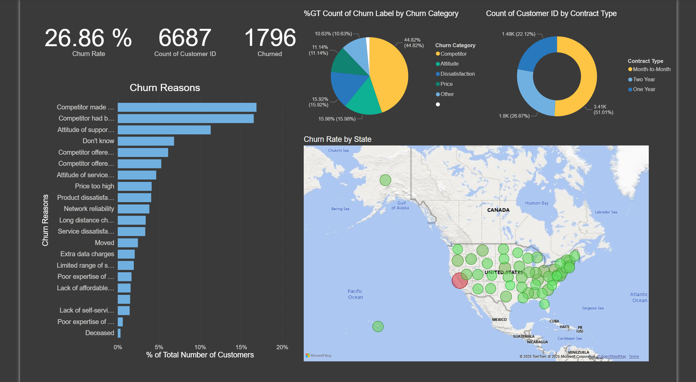
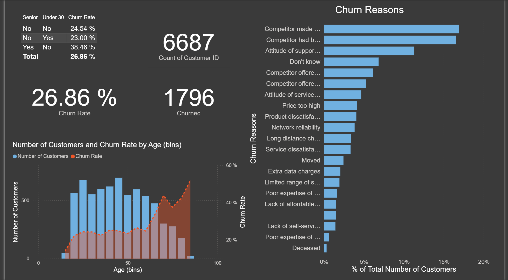
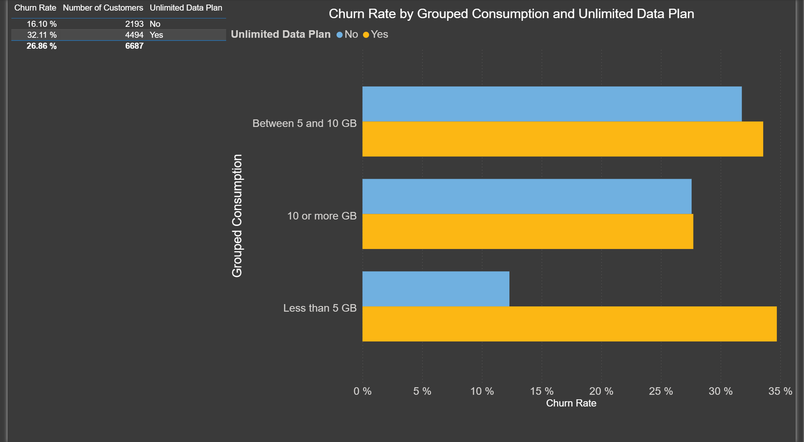
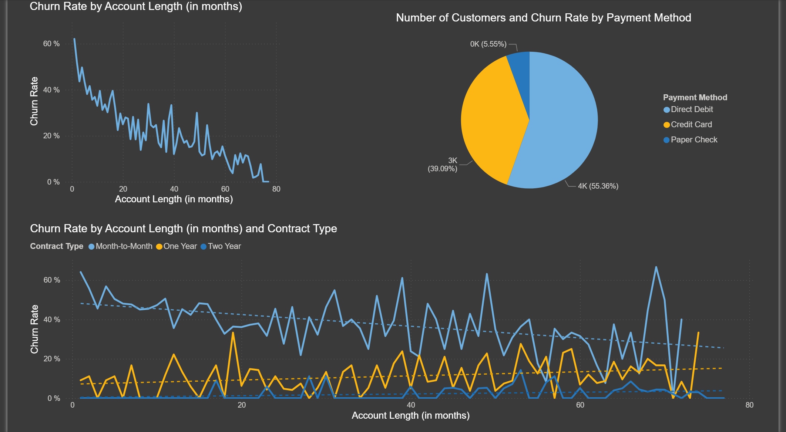
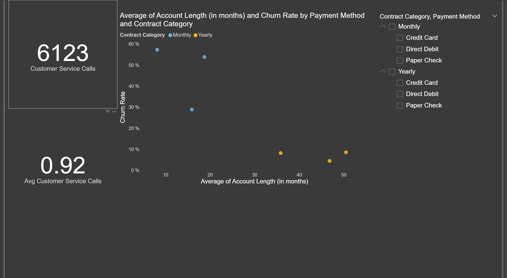
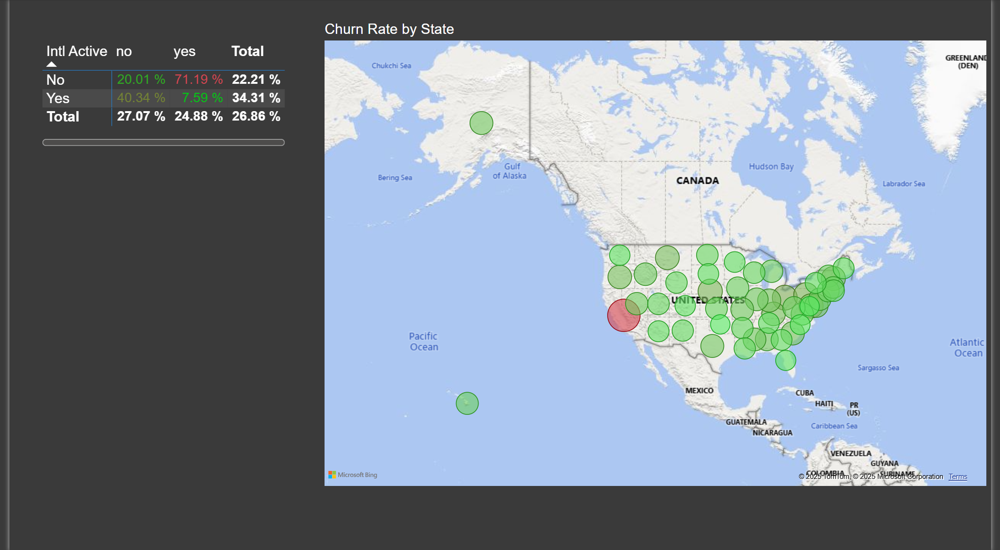
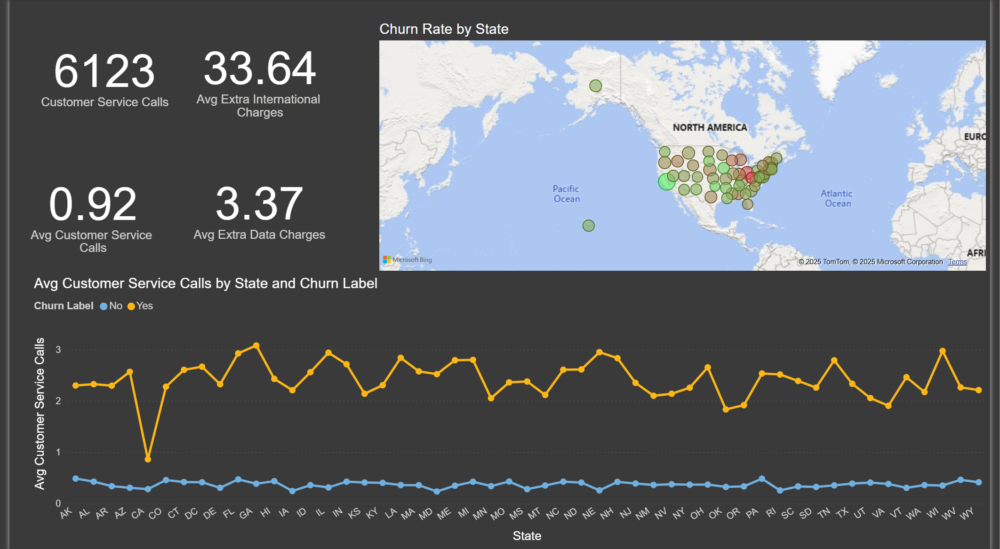

# Case Study: Customer Churn Analysis for Databel #

  

## 1. Introduction ##
Databel is an internet service provider experiencing a loss of customers. The company wants to know why the customers are churning. In this case study, we will analyze the company data using Power BI to gain insights into the problem.

## 2. Churn Demographics ##
We will first look at the overall churn rate of the Company, its distribution across various age groups, and churn reasons.

  

We observe that:
* The overall customer churn rate is 27%, with seniors experiencing a significantly higher churn rate (38%) compared to other groups.
* The top reasons for churn are competitor offers and poor support/service attitudes, each accounting for a large share of lost customers.
* Churn rate increases sharply with age, especially for customers over 60, despite a lower total number of customers in that age group.

## 3. Unlimited Plan ##
Next, we will look at the churn rate by data consumption and the type of plan.

  

We observe that customers who have an unlimited plan and low data consumption (< 5 GB) are most likely to churn.

## 4. Contract Type ##
Now let's look at the effect of contract type, account length, and payment method on churn rate.

  
  

We see that:
* Overall, the churn rate decreases with the account length.
* The month-to-month contracts have a consistently high churn rate, and the churn rate decreases with the account length. 
* The customers with a month-to-month contract have the shortest account length.
* In month-to-month contracts, the customers with payment methods as direct debit and paper check are most likely to churn.
* Most customers pay by direct debit, 55% of whom are likely to churn.

## 5. International Calls ##
International calls are expensive. Let's look at the customers who make international calls and see if they have plan that is most suitable to them.

  

We see that customers with mismatched plans are most likely to churn, i.e. customers on an international plan but not making any international calls (71% churn rate), and customers not on an international plan but making international calls (40% churn rate). 

## 6. Customer Service Calls ##
Let's identify the most distressed regions in the country based on the average number of customer service calls received.

  

Interestingly, although California has the highest churn rate, the average number of customer service calls is the lowest. Basically, the customers are leaving without making any complaints about the service itself. On further analysis, I found out that in California, the competitors provided them with better offers, which made the customers leave.

## 7. Conclusion ##
Key Insights from the customer churn analysis for Databel:
* The overall customer churn rate is high at 27%, with seniors (age 60+) experiencing the highest churn rate of 38%, despite being a smaller segment of the customer base.
* The leading reasons for customer churn are competitor offers and dissatisfaction with support/service attitudes, each accounting for a significant share of lost customers.
* Churn rates increase sharply with age, indicating older customers are more likely to leave, even though they represent a smaller portion of total customers.
* Customers on unlimited plans with low data consumption (<5 GB) are the most likely to churn, suggesting a mismatch between plan offerings and actual usage.
* Month-to-month contracts show consistently high churn rates, especially among customers with shorter account lengths. The longer a customer stays, the less likely they are to churn.
* Payment method impacts churn: customers on month-to-month contracts who pay by direct debit or paper check are most at risk, with 55% of direct debit customers likely to churn.
* Plan mismatch strongly drives churn for international calling: customers who have an international plan but do not use it, and those who make international calls without the appropriate plan, exhibit churn rates of 71% and 40%, respectively.
* Regional analysis reveals that in California, the churn rate is the highest, yet the average number of customer service calls is the lowest. This suggests customers are leaving due to better competitor offers rather than dissatisfaction with service, often without voicing complaints.

[LinkedIn Profile](https://www.linkedin.com/in/praveen-satya-r-v/) |
[Portfolio](https://praveensatyarv.github.io/)

<i>NOTE: This project is part of the Datacamp course - Analyzing Customer Churn in Power BI.</i>